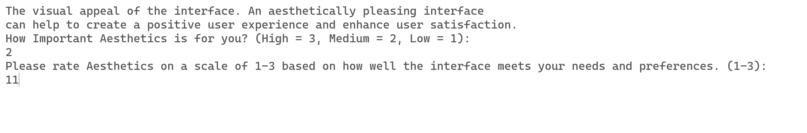
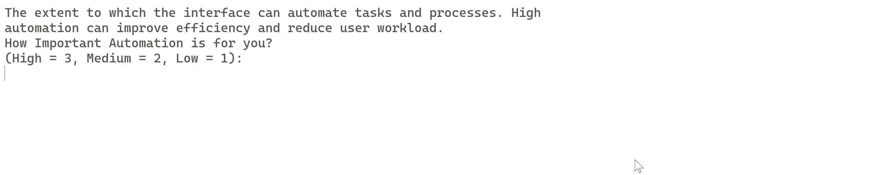

# UI-Match

This is the Interface of the Interfaces. Know what you have to build before you even start any development! 
The UI-Match (or "Interface Matchmaker") is a console application that helps users identify the best interface for their needs based on their preferences and priorities.

| User Interface Type            | Description                                                                                                     |
|--------------------------------|-----------------------------------------------------------------------------------------------------------------|
| Command-line Interface (CLI)   | A text-based interface that relies on commands entered through a keyboard and displayed through a command prompt  |
| Graphical User Interface (GUI) | A visual interface that allows users to interact with a computer through graphical elements such as buttons, menus, and icons |
| Web Interface					 | A GUI that is accessed through a web browser and typically consists of web pages that are displayed on a screen |
| Mobile Interface				 | A GUI that is designed specifically for use on mobile devices such as smartphones and tablets |
| Speech Interface               | A user interface that relies on voice commands and responses |
| Virtual Reality Interface      | A user interface that allows users to interact with a computer-generated environment in a three-dimensional space |
| Augmented Reality Interface    | A user interface that overlays computer-generated elements onto the real-world environment |
| Gesture-Based Interface        | A user interface that allows users to interact with a computer through physical gestures, such as waving a hand or pointing a finger |

## Criterias 
| User Interface Type        | Usability | Accessibility | Speed  | Customizability | Aesthetics | Functionality | Consistency | Feedback | Automation | Overall Score     | Additional Arguments                                         | Possible Applications                                                 |
|---------------------------|-----------|---------------|--------|----------------|------------|---------------|-------------|----------|------------|-------------------|--------------------------------------------------------------|-----------------------------------------------------------------------|
| Web Interface              | High      | High          | Medium | High           | High       | High          | High        | High     | Medium     | 8.5 (High-Medium) | Accessible from anywhere, Cross-platform compatibility, Easy to update and maintain | E-commerce websites, Social media platforms, Online collaboration tools, Web-based applications and services |
| Augmented Reality Interface| High      | Medium        | Medium | Medium         | High       | High          | Medium      | High     | Low        | 7.5 (High-Low)   | Provides context and information overlay, Used for visualizations and design, Requires specialized hardware and software | Education and training simulations, Product visualization and marketing, Navigation and location-based applications, Gaming and entertainment |
| Graphical User Interface  | High      | Medium        | Medium | High           | High       | High          | Medium      | High     | Medium     | 8.5 (High-Medium) | Intuitive and easy to learn, Highly customizable with themes and plugins, Provides visual feedback to users | Desktop and mobile applications, Video and photo editing software, Gaming and entertainment software, Operating systems and system tools |
| Mobile Interface           | Medium    | High          | Medium | Medium         | High       | High          | Medium      | High     | Medium     | 8.0 (Medium-Medium) | Highly portable and convenient, Optimized for touch interaction, Uses mobile device hardware features like camera and GPS | Mobile apps for social media and communication, Navigation and maps, Mobile gaming and entertainment, Health and fitness apps |
| Command-line Interface     | High      | Low           | High   | Low            | Low        | High          | Low         | Low      | High       | 7.0 (Low-High)   | Fast and efficient for experienced users, Customizable using scripts and automation tools, Can be used over an SSH connection for remote management | Server management and automation, Programming and development tasks, Networking and system administration tasks, Data analysis and processing |
| Virtual Reality Interface  | High      | Low           | Low    | Medium         | High       | High          | Low         | High     | Low        | 6.5 (Low-Low)    | Provides immersive and engaging experiences, Used for training and simulations, Requires specialized hardware and setup | Virtual reality gaming and entertainment, Training and simulation programs for military and aviation, Medical and therapy applications, Architecture and design visualization |
| Gesture-Based Interface    | Medium    | Medium        | Medium | Low            | High       | Medium        | Low         | High     | Low        | 6.5 (Low-Low)    | Intuitive and natural for some users, Used for interactive exhibits and kiosks, May be limited in functionality compared to other interfaces | Public interactive displays and exhibits, Kiosks and information centers, Gaming and entertainment, Rehabilitation and therapy applications |
| Speech Interface           | Medium    | Medium        | Medium | Low            | Low        | Medium        | Low         | High     | Medium     | 6.5 (Low-Medium) | Hands-free and accessible for people with disabilities, Used in noisy or hands-busy environments, Used for tasks like dictation and voice commands | Hands-free operation of devices in cars and other vehicles, Home automation and smart home control, |

## Methods 

Criteria|Explanation|Scoring Method|Measurement Methods|Methods Details
Usability|How easy it is for users to interact with the interface and perform tasks. A highly usable interface is intuitive and requires minimal training for users to understand and use effectively.|High, Medium, Low|Usability testing, surveys, user feedback|Usability testing can be conducted to measure how easy it is for users to interact with the interface and perform tasks. This can involve observing users as they use the interface to complete specific tasks and recording any issues or difficulties they encounter.
Accessibility|How easily people with disabilities can use the interface. An accessible interface is designed to accommodate a range of physical and cognitive disabilities, such as visual impairments, hearing impairments, or mobility impairments.|High, Medium, Low|Accessibility testing, surveys, user feedback|Accessibility testing can be conducted to measure how easily people with disabilities can use the interface. This can involve using assistive technologies, such as screen readers or voice recognition software, to test the interface with a range of disabilities.
Speed|How quickly the interface can perform tasks and respond to user inputs. A fast interface is important for improving productivity and user satisfaction.|High, Medium, Low|Performance testing, benchmarking|Performance testing can be conducted to measure how quickly the interface can perform tasks and respond to user inputs. This can involve measuring the time it takes for the interface to load, process data, or respond to user actions.
Customizability|The extent to which users can personalize the interface to their needs and preferences. A highly customizable interface allows users to adjust features and settings to suit their individual needs and work style.|High, Medium, Low|Surveys, user feedback|Surveys or user feedback can be used to measure how much users are able to customize the interface to their needs and preferences. This can involve asking users to rate the extent to which they are able to adjust features or settings in the interface.
Aesthetics|The visual appeal of the interface. An aesthetically pleasing interface can help to create a positive user experience and enhance user satisfaction.|High, Medium, Low|Surveys, user feedback|User feedback or surveys can be used to measure the visual appeal of the interface. This can involve asking users to rate the interface's design or visual elements.
Functionality|The range of tasks and activities that the interface can perform. A highly functional interface can accommodate a range of user needs and tasks.|High, Medium, Low|Testing, reviews, user feedback|Testing or reviews can be conducted to measure the range of tasks and activities that the interface can perform. This can involve evaluating the interface's features and capabilities against user needs and requirements.
Consistency|How consistently the interface performs tasks and displays information. A consistent interface helps users to predict how the interface will behave and can improve usability.|High, Medium, Low|Testing, user feedback|Testing or user feedback can be used to measure how consistently the interface performs tasks and displays information. This can involve evaluating the interface's behavior and responses across different tasks or scenarios.
Feedback|The extent to which the interface provides feedback to users on their actions and interactions. Feedback can help users to understand how the interface works and can help to guide their actions.|High, Medium, Low|Surveys, user feedback|User feedback or surveys can be used to measure the extent to which the interface provides feedback to users on their actions and interactions. This can involve asking users to rate the interface's feedback mechanisms, such as error messages or notifications.
Automation|The extent to which the interface can automate tasks and processes, reducing the need for user input. An interface with high automation can improve efficiency and reduce user workload.|High, Medium, Low|Surveys

## Installation

To run the application, simply download the source code and compile it using a C# compiler. The application has been tested on Windows and Linux platforms.

## Usage

To use the application, run the executable file and follow the prompts. The application will ask you to rate the importance of various criteria (such as ease of use, speed, and customizability) and to rate different interfaces on a scale of 1-3 based on how well they meet those criteria. The application will then calculate a weighted score for each interface and provide a recommendation based on your preferences.

## Contributing

If you find a bug or would like to suggest a new feature, please submit an issue on the GitHub repository. 

## Disclamer

This tool was built with OpenAI's amazing ChatGPT, so please use your commonsense or other methods before jump into conclusions. 

## License

This project is licensed under the MIT License - see the LICENSE file for details.
